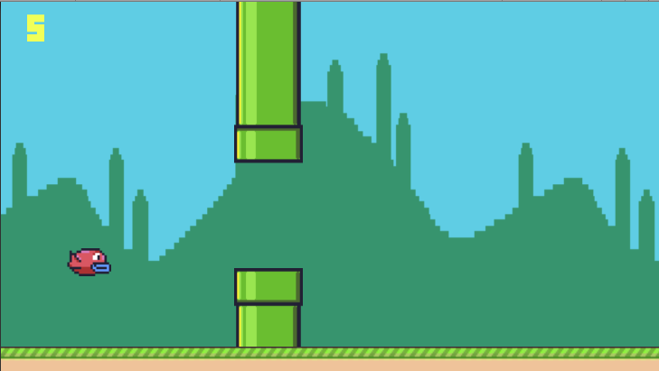

# Flappy Bird
A Flappy Bird clone using Unity to practice my Unity knowledge in action.

The assets belongs to CS50's [Introduction to Game Programming](https://github.com/games50/fifty-bird) course.